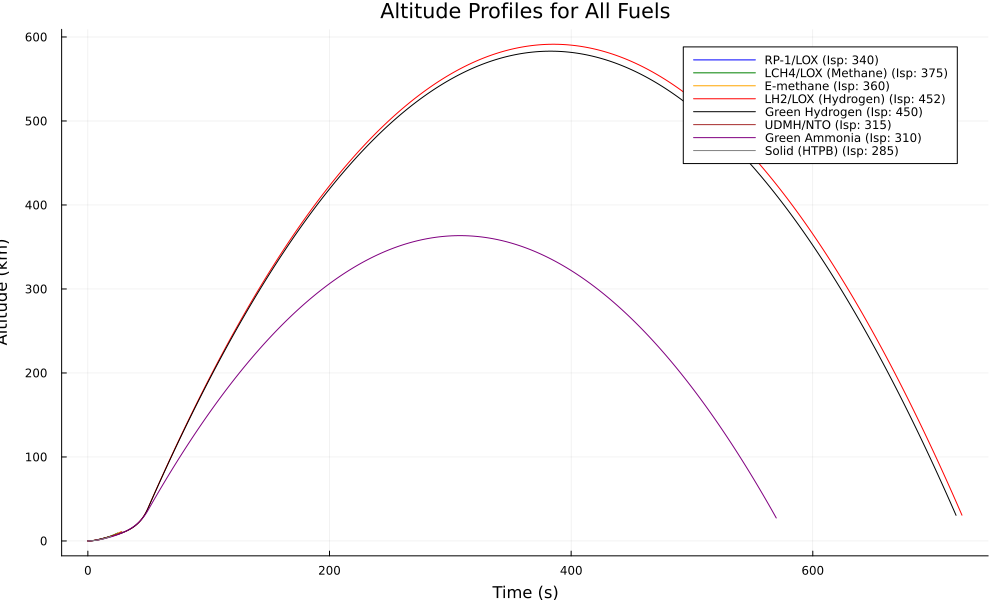
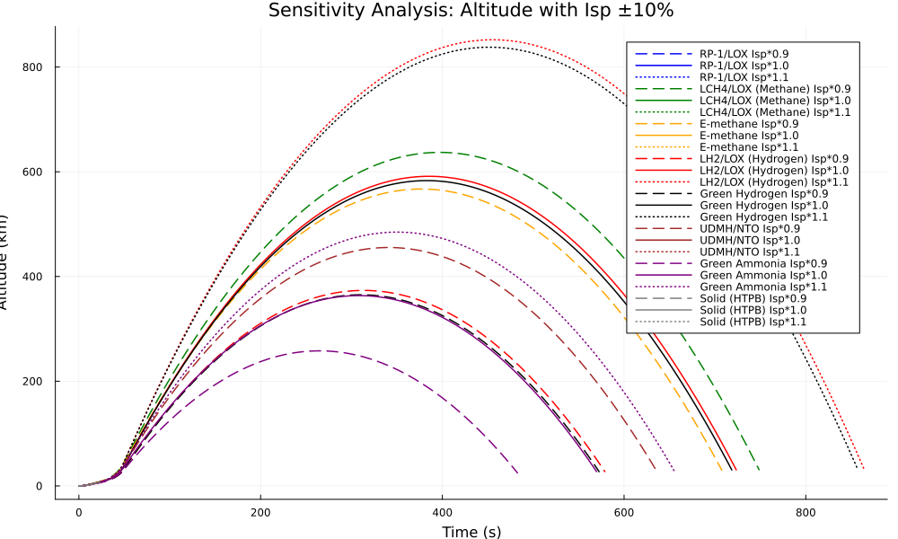
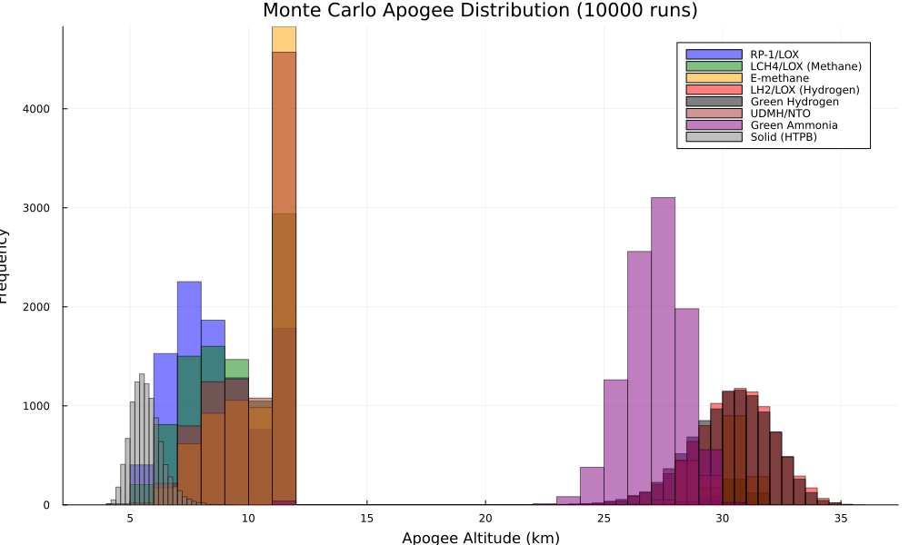
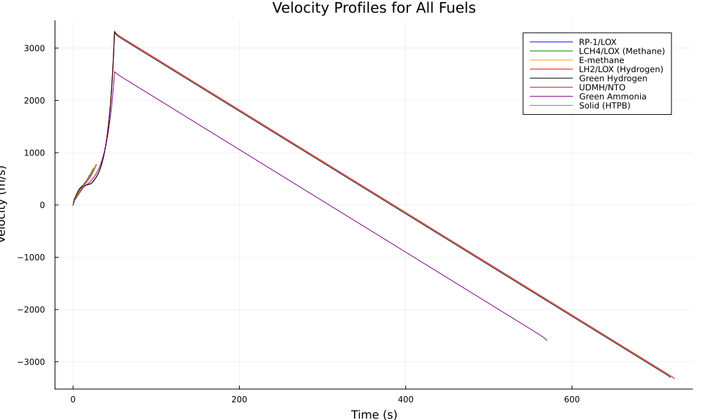
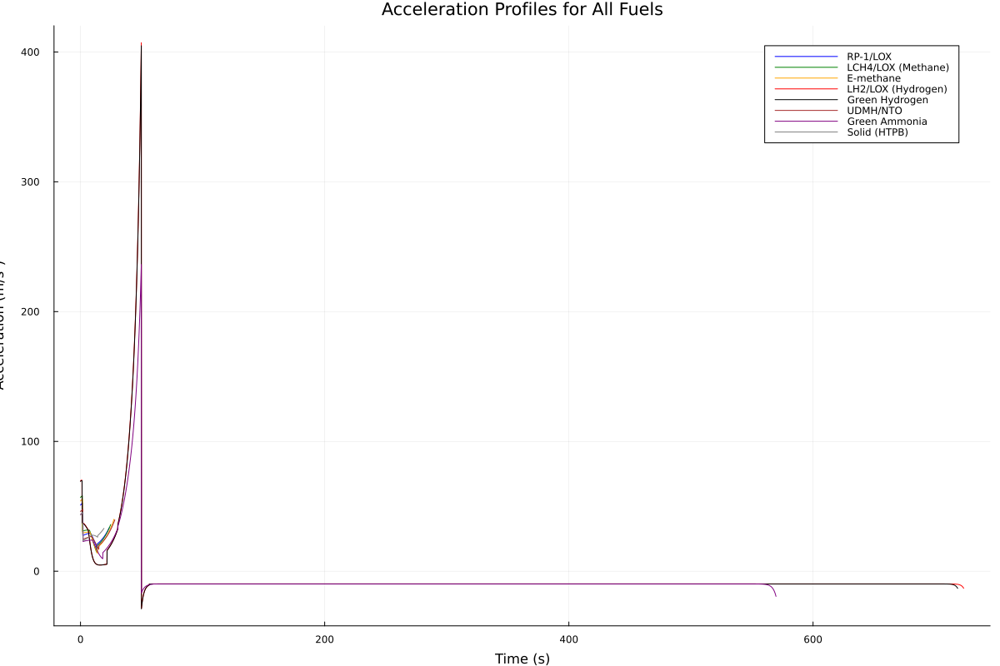

# Rocket Simulation

A very simple rocket simulation in 1D 

### Graph Outputs:
- Altitude Graph:

- Fuel Sensitivity Analysis Graph:

- Monte Carlo Simulation Graph:

- Velocity Graph:

- Acceleration Graph:

